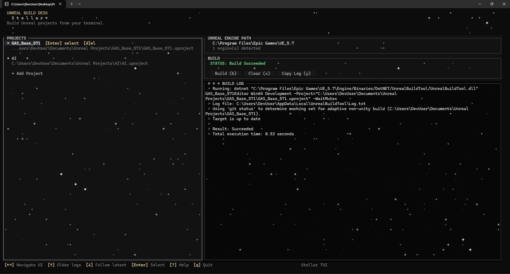

# Stellar TUI

Terminal UI for managing and building Unreal Engine projects.



## Features

- Project list with persistent project selection
- Unreal Engine path selection (auto-detect + manual)
- Build controls with live output log panel
- Keyboard-first navigation across Projects, Engine, Build, and Logs

## Keyboard Controls

- `Left` / `Right` or `Tab` / `Shift+Tab`: move between UI sections
- `Up` / `Down`: move within the current section (in Logs: `Up` shows older lines, `Down` returns to follow-latest)
- `Enter`: activate/select focused item
- `a`: add project using manual path input
- `f`: add project using file picker dialog
- `d` or `Delete`: remove focused project (with confirmation)
- `e`: set engine path / open engine picker
- `r`: re-detect engine installs
- `b`: start build
- `n`: clean rebuild (remove temp files, regenerate project files, then build)
- `c`: cancel build
- `x`: clear logs
- `y`: copy logs to clipboard
- `?`: help
- `q`: quit

## Install (Recommended)

For most users, just download and run the Windows installer from Releases:

- `Stellar-setup-<version>.exe`

Release page:

- `https://github.com/Thornvald/Stellar-TUI/releases`

For macOS and Linux, download the matching release binary from the same page:

- `Stellar-macos-<arch>`
- `Stellar-linux-<arch>`

The installer:

- installs Stellar to `Program Files\Stellar`
- adds Stellar to your user `PATH`
- creates Start Menu shortcuts

After install, open a new terminal and run:

```bash
stellar
```

For macOS/Linux release binaries, mark executable if needed and run directly.

## Winget

When available:

```bash
winget install Thornvald.StellarTUI
```

If Winget cannot find it yet, use the GitHub Releases installer.

## Build from Source (Optional)

Only needed if you want to rebuild locally.

Prerequisite:

- Rust (stable): https://rustup.rs

Build release binary:

```bash
cargo build --release
```

Output:

- Windows: `target/release/stellar.exe`
- Linux/macOS: `target/release/stellar`

## How Releases Are Built

Releases can be built automatically with GitHub Actions using `.github/workflows/release.yml`.

- Maintainers push a version tag like `v0.92.1`
- GitHub Actions builds the app and installer
- The workflow publishes the installer to GitHub Releases

## Repository

- Source and releases: `https://github.com/Thornvald/Stellar-TUI`
